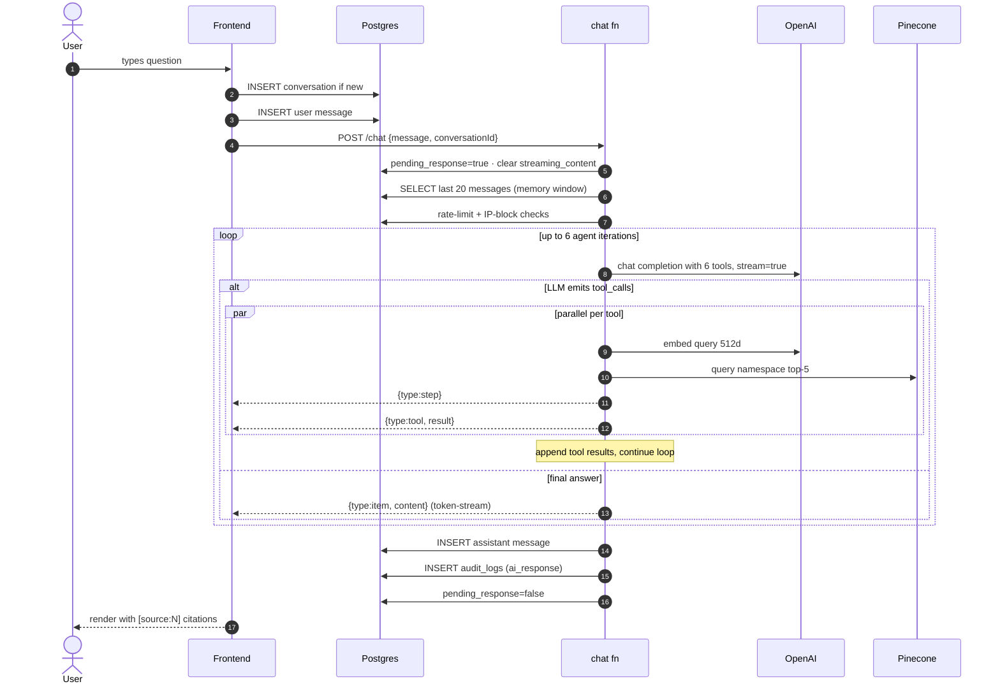
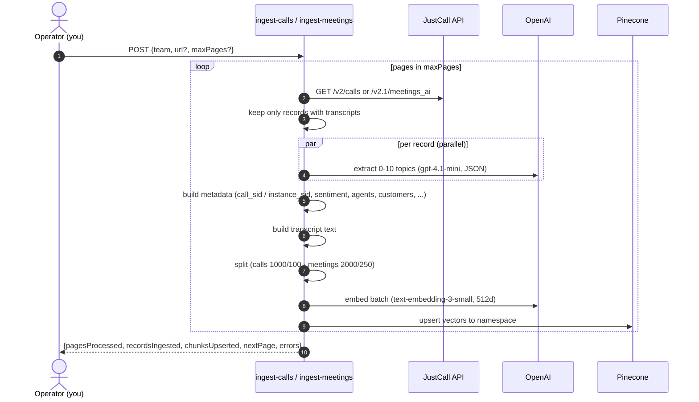

# Echo Architecture

JustCall voice-of-customer intelligence assistant. Frontend hosted by Lovable; backend (DB, edge functions, ingestion) lives in this repo and runs on Supabase project `wgemenpbwxrtkmxbcmna`.

## High-level system

```mermaid
graph TB
  U[👤 User]:::user

  subgraph FRONTEND[Frontend - React + Vite]
    LV[Lovable hosted<br/>echo-justcall.lovable.app]
    DEV[Local dev<br/>localhost:8080]
    GH[(GitHub<br/>sayush865/echo-justcall)]
  end

  subgraph SUPABASE[Supabase project: wgemenpbwxrtkmxbcmna]
    AUTH[Auth]
    PG[(Postgres<br/>conversations · messages<br/>audit_logs · blocked_ips<br/>+ admin tables)]

    subgraph FUNCS[Edge Functions Deno]
      F_CHAT[chat<br/>native agent loop]
      F_TITLE[generate-title]
      F_FOLLOW[generate-followups]
      F_SUGG[analyze-suggestions]
      F_ICALL[ingest-calls]
      F_IMEET[ingest-meetings]
    end
  end

  subgraph EXT[External]
    OAI[OpenAI<br/>gpt-4.1 · gpt-4.1-mini<br/>text-embedding-3-small 512d]
    PINE[(Pinecone &#39;echo&#39; index<br/>6 namespaces:<br/>Sales/CS/Support × Calls/Meetings)]
    JC[JustCall API<br/>v2 calls · v2.1 meetings_ai]
  end

  U --> LV
  U -. dev .-> DEV
  GH -- auto-build --> LV
  DEV -- npm run dev --> GH

  LV --> AUTH
  LV --> PG
  LV --> F_CHAT
  LV --> F_TITLE
  LV --> F_FOLLOW
  LV --> F_SUGG

  F_CHAT <--> PG
  F_CHAT --> OAI
  F_CHAT --> PINE
  F_TITLE --> OAI
  F_FOLLOW --> OAI
  F_SUGG --> OAI

  U -. manual .-> F_ICALL
  U -. manual .-> F_IMEET
  F_ICALL --> JC
  F_ICALL --> OAI
  F_ICALL --> PINE
  F_IMEET --> JC
  F_IMEET --> OAI
  F_IMEET --> PINE

  classDef user fill:#fef3c7,stroke:#f59e0b
```

## It's agentic RAG

Echo is a Retrieval-Augmented Generation system. The LLM doesn't answer from training data — it retrieves customer conversations from Pinecone first, then synthesizes. "Agentic" because the LLM picks *which* corpus to search and *what* query to use, rather than running a fixed retriever.

| RAG element | Where it lives |
|---|---|
| **R**etrieval | Pinecone vector search across 6 namespaces (one per team × calls/meetings) |
| **A**ugmentation | Tool results appended to the LLM's message list as `tool` messages |
| **G**eneration | GPT-4.1 streams the cited answer using the augmented context |

### Complete pipeline (indexing + query)

```mermaid
flowchart TB
  subgraph INGEST["📥 Indexing pipeline · ingest-calls / ingest-meetings"]
    direction TB
    JC[JustCall API<br/>v2/calls · v2.1/meetings_ai<br/>per team · paginated]
    JC --> FILT[Filter: keep only records<br/>with non-empty transcripts]
    FILT --> TOPICS[Topic extraction<br/>gpt-4.1-mini · JSON output]
    FILT --> META[Build metadata<br/>call_sid / instance_sid · sentiment<br/>agents · customers · date · summary]
    TOPICS --> META
    META --> XSCRIPT[Format transcript<br/>calls: sentence + timestamps<br/>meetings: name: text + timestamps]
    XSCRIPT --> SPLIT[Recursive char split<br/>calls: 1000/100 · meetings: 2000/250]
    SPLIT --> EMBED1[Embed batch<br/>text-embedding-3-small · 512d]
    EMBED1 --> UPSERT[Pinecone upsert<br/>vectors + flat metadata]
  end

  subgraph STORE["🗂️ Pinecone 'echo' index · 512-dim · 6 namespaces"]
    direction LR
    NS1[Sales Calls]
    NS2[CS Calls]
    NS3[Support Calls]
    NS4[Sales Meetings]
    NS5[CS Meetings]
    NS6[Support Meetings]
  end

  subgraph QUERY["🔍 Query pipeline · chat edge function"]
    direction TB
    U[👤 User question]
    DB[(Postgres messages table<br/>last 20 turns)]
    DB --> HIST[Conversation memory]
    U --> PLAN
    HIST --> PLAN[GPT-4.1 planner<br/>+ system prompt]
    PLAN -->|tool routing| TOOLS{Select 1–6 of 6 tools<br/>+ write search query per tool}
    TOOLS --> EMBED2[Embed each rewritten query<br/>text-embedding-3-small · 512d]
    EMBED2 --> RETR[Pinecone query<br/>top-5 per namespace · parallel]
    RETR --> CHUNKS[Retrieved chunks<br/>+ CA-prefixed call_sid / instance_sid]
    CHUNKS --> AUG[Augment context<br/>append results as tool messages]
    AUG --> GEN[GPT-4.1 generation<br/>streaming NDJSON to client]
    GEN -. agent loop · up to 6 iterations<br/>re-plan if more info needed .-> PLAN
    GEN --> ANS[Cited answer<br/>source:N → CA-IDs · Sources block]
    ANS -. persisted .-> DB
  end

  UPSERT --> STORE
  STORE --> RETR

  classDef ret fill:#dbeafe,stroke:#3b82f6,color:#1e3a8a
  classDef aug fill:#fef3c7,stroke:#f59e0b,color:#78350f
  classDef gen fill:#dcfce7,stroke:#16a34a,color:#14532d
  classDef ind fill:#ede9fe,stroke:#7c3aed,color:#4c1d95
  classDef store fill:#fce7f3,stroke:#db2777,color:#831843

  class JC,FILT,TOPICS,META,XSCRIPT,SPLIT,EMBED1,UPSERT ind
  class NS1,NS2,NS3,NS4,NS5,NS6 store
  class EMBED2,RETR,CHUNKS,TOOLS ret
  class AUG,HIST,DB aug
  class U,PLAN,GEN,ANS gen
```

Reading the diagram:
- **Purple** = indexing (write path, run on demand via `ingest-calls` / `ingest-meetings`)
- **Pink** = the shared vector store, partitioned by team × surface
- **Blue** = retrieval (query embed + top-K vector search)
- **Yellow** = augmentation (history + tool results into the LLM context)
- **Green** = generation + the user-visible pieces

What makes it *agentic* rather than vanilla RAG:
- **Routing** — the LLM picks which corpus to query (system prompt teaches it: "CS query → cs_calls + cs_meetings", "general → all six")
- **Query rewriting** — each tool call gets its own optimized search string, not the raw user input
- **Iteration** — the agent can call tools, see results, decide to call more (capped at 6 turns to prevent loops)
- **Multi-corpus fan-out** — typical query hits 2–6 namespaces in parallel, then merges

What we deliberately skipped (vanilla RAG patterns worth adding later):
- **Reranking** — pure top-5 vector hits today; n8n had `useReranker: true`. Easy add via Pinecone Inference API or Cohere Rerank
- **Hybrid search** — pure dense vector; adding BM25/sparse helps for keyword-heavy queries (call SIDs, customer names, product POD names)
- **Query decomposition** — for multi-part questions, splitting into sub-queries before retrieval often beats letting the LLM iterate

## Chat request flow (read path)

## Ingest flow (write path)

## Components

### Frontend
- React 18 + Vite + TypeScript + Tailwind + shadcn/ui
- Auth via Supabase
- Routes: `/` (chat), `/c/:id` (conversation), `/admin` (admin dashboard), `/shared/:token` (public share)
- Streaming UI parses NDJSON events: `{type:item}`, `{type:step}`, `{type:tool}`, `{type:thinking}`

### Edge functions
| Function | Purpose | Key external calls |
|---|---|---|
| `chat` | Native agent loop replacing the n8n webhook. Streams NDJSON to client. | OpenAI chat, OpenAI embeddings, Pinecone query |
| `generate-title` | One-shot title from user's first message | OpenAI |
| `generate-followups` | Suggested follow-up questions | OpenAI |
| `analyze-suggestions` | Admin/insight feature | OpenAI |
| `ingest-calls` | Pull JustCall calls → embed → Pinecone | JustCall, OpenAI, Pinecone |
| `ingest-meetings` | Pull JustCall meetings → embed → Pinecone | JustCall, OpenAI, Pinecone |

### Pinecone namespaces (in `echo` index, 512d)
| Namespace | Source workflow |
|---|---|
| `Sales Calls` | ingest-calls?team=sales |
| `Customer Success Calls` | ingest-calls?team=success |
| `Customer Support Calls` | ingest-calls?team=support |
| `Customer Sales Meetings` | ingest-meetings?team=sales |
| `Customer Success Meetings` | ingest-meetings?team=success |
| `Customer Support Meetings` | ingest-meetings?team=support |

### Required Supabase function secrets
- `OPENAI_API_KEY`
- `PINECONE_API_KEY`
- `PINECONE_INDEX_HOST` (optional; auto-discovered if unset)
- `JUSTCALL_TOKEN_SALES`
- `JUSTCALL_TOKEN_SUCCESS`
- `JUSTCALL_TOKEN_SUPPORT`

## Notes

- **No n8n anywhere.** It used to sit between the chat function and OpenAI/Pinecone and run the 6 embedding workflows. Both are now in `supabase/functions/`.
- **Memory** is the conversation's `messages` table — last 20 rows passed as OpenAI message history. No vector memory.
- **Citations** come from Pinecone match metadata — `call_sid` for calls, `instance_sid` for meetings, both CA-prefixed.
- **Resilience**: if the user closes the browser mid-stream, the agent keeps running in the background via `EdgeRuntime.waitUntil` and saves the full response to `messages`.
- **Rate limit**: 20 requests/min per user (or per IP if anonymous), enforced by counting `audit_logs` rows in the last 60s.
- **Lovable role**: pure static hosting only. Supabase integration is disconnected; backend is owned entirely by this repo.
